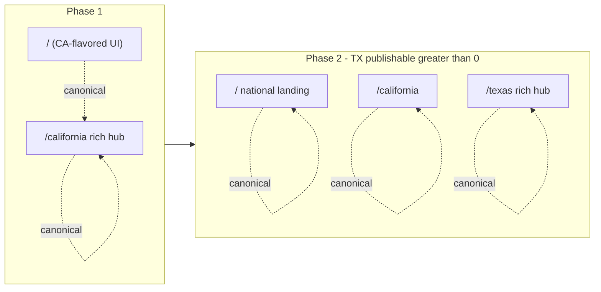

# State hub architecture

This doc defines how the **national homepage** (`/`), **rich state hubs** (e.g. `/california`), and **thin state indexes** (`/[state]` during rollout) relate to each other. Implementation lives under `src/components/state-hub/`, `src/lib/stateHubConfig.ts`, and `src/lib/data/stateHub.ts`.

---

## Phased clone (Phase 1 vs Phase 2)

### Phase 1 (current target)

- **`/`** — Same California-focused sections as before (hero, stats, methodology, browse CA, editorial, reviews, FAQ). **Canonical URL:** `canonicalFor("/california")` so search engines consolidate on `/california`. **No `FAQPage` JSON-LD** on `/` (see SEO below).
- **`/california`** — Same UI as `/`, built from shared state-hub components. **Canonical:** self. Owns **FAQPage** + full editorial hub JSON-LD for California.
- **`/[state]`** (e.g. `/texas`) — **Thin** counties + cities grid only until the state has publishable facilities and we promote to the rich template. Avoids thin rich URLs competing for state queries with no data.

### Phase 2 (migration trigger)

**When:** `SELECT count(*) FROM facilities WHERE state_code = 'TX' AND publishable = true` is **≥ 1** (or editorial agrees on a different gate).

**Then:**

1. Slim **`/`** to a national landing: state directory, cross-state editorial pillars, brand methodology teaser, national FAQ.
2. Set **`/`** canonical to **`canonicalFor("/")`** (self).
3. Promote **`src/app/[state]/page.tsx`** to compose the rich state-hub components for each covered state (CA, TX, …), with thin fallback when `publishable = 0` for that state.
4. Ensure **one FAQPage** per URL — national FAQs on `/`, state FAQs on `/[state]` rich hubs.

---

## Section ownership matrix

| Section | `/` Phase 1 | `/` Phase 2 | `/california` (rich) | `/texas` thin | `/texas` rich |
|--------|-------------|-------------|------------------------|---------------|---------------|
| GovernanceBar + SiteNav | Yes | Yes | Yes | Yes | Yes |
| Hero (state headline, ZIP, illustration) | CA copy | National | CA config | Minimal header | TX config |
| StatBlock (facilities, inspections, citations) | CA-scoped | National or omit | CA-scoped | Omit | TX-scoped |
| Methodology + sample facility card | CA | National teaser | CA | Omit | TX |
| Browse counties / cities | CA | State directory | CA | Counties + cities | TX |
| Editorial cards | CA links | Cross-state | CA links | Omit | TX links |
| Reviews | CA or all | Mixed policy | CA-scoped | Omit | TX-scoped |
| FAQ | Rendered (no FAQ JSON-LD on `/` in Phase 1) | National FAQs | CA FAQs + FAQPage | Omit | TX FAQs + FAQPage |
| Footer CTA | CA | National | CA | Minimal | TX |

---

## SEO rules (Phase 1)

- **`canonicalFor("/california")`** on `/california`; **`alternates.canonical`** on `/` points to `/california`.
- **`FAQPage`** schema only on **`/california`** for the CA FAQ set — not duplicated on `/`.
- **`Organization`** + **`WebSite`** may remain on `/` (site-level).
- **`/california`** must include **`BreadcrumbList`**, **`WebPage`** (`reviewedBy` where applicable), **`CollectionPage`** — see [`AGENTS.md`](../AGENTS.md) and [`docs/SEO_GEO_CONVENTIONS.md`](SEO_GEO_CONVENTIONS.md).

---

## Component inventory

| Component | Role |
|-----------|------|
| `StateHubHero` | Eyebrow, H1, italic hook, ZIP search, coverage line, hero illustration |
| `StateHubStats` | `SectionHead` + `StatBlock` |
| `StateHubMethodology` | §02 explainer + `SyncedHomeSampleCardDesktop` + 3-step grid |
| `StateHubBrowse` | Counties list + popular cities |
| `StateHubEditorial` | §04 dark editorial cards |
| `StateHubReviews` | §05 verified reviews |
| `StateHubFaq` | §06 FAQ accordion |
| `StateHubCta` | Rust closing strip |

Configuration: **`src/lib/stateHubConfig.ts`** (`hero`, `editorialCards`, `sourceAgencyLabel`, … per `state_code`).

Data loading: **`src/lib/data/stateHub.ts`** — `loadStateHubData(stateCode)` returns stats, counties, cities, sample facilities, reviews.

---

## Texas thin `/texas` behavior

Until inspection ingest + publish gate produce publishable TX rows, **`/texas`** stays the thin template in **`src/app/[state]/page.tsx`** — county cards + city links only. Do not duplicate the full CA homepage at `/texas` without data (thin-page / trust reasons).

After Phase 2 trigger, reuse the same components as `/california` with **`stateHubConfig`** for `TX` and HHSC copy paths.
