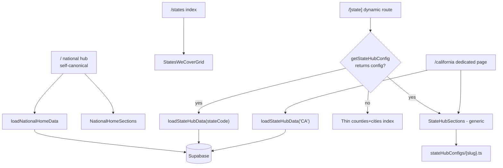

# State hub architecture

This doc defines how the **national homepage** (`/`), **rich state hubs** (e.g. `/california`, `/oregon`), and the **thin state index** (`/[state]` fallback) relate to each other. The Phase 1 → Phase 2 migration described in older versions of this doc is **complete**. The national homepage shipped in May 2026.

---

## Live routing overview

---

## Route table

| Path | Page file | Template | Canonical |
|------|-----------|----------|-----------|
| `/` | `src/app/page.tsx` | `NationalHomeSections` | `canonicalFor("/")` (self) |
| `/states` | `src/app/states/page.tsx` | Simple state grid | `canonicalFor("/states")` |
| `/california` | `src/app/california/page.tsx` | `StateHubSections` + `caStateConfig` | `canonicalFor("/california")` |
| `/oregon` | `src/app/[state]/page.tsx` | `StateHubSections` + `orStateConfig` | `canonicalFor("/oregon")` |
| `/washington` | `src/app/[state]/page.tsx` | `StateHubSections` + `waStateConfig` | `canonicalFor("/washington")` |
| `/minnesota` | `src/app/[state]/page.tsx` | `StateHubSections` + `mnStateConfig` | `canonicalFor("/minnesota")` |
| `/texas` | `src/app/[state]/page.tsx` | `StateHubSections` + `txStateConfig` | `canonicalFor("/texas")` |
| `/[state]` (other slugs) | `src/app/[state]/page.tsx` | Thin index (counties + cities) | `canonicalFor("/[state]")` |

---

## Component inventory

| Component | Role |
|-----------|------|
| `StateHubHero` | Eyebrow, H1, italic hook, optional ZIP search, coverage line, hero illustration |
| `StateHubStats` | `SectionHead` + `StatBlock` |
| `StateHubMethodology` | §02 explainer + `SyncedHomeSampleCardDesktop` + 3-step grid |
| `StateHubBrowse` | Counties list + popular cities (state-scoped) |
| `StateHubEditorial` | §04 dark editorial cards |
| `StateHubReviews` | §05 verified reviews |
| `StateHubFaq` | §06 FAQ accordion |
| `StateHubCta` | Rust closing strip with browse CTA |
| `NationalHomeSections` | National homepage sections: hero, national stats, states grid, state-aware city leaderboard |
| `StatesWeCoverGrid` | Five-card grid linking to `/[state]` pages |

---

## Config files

Each state hub is driven by a config object in `src/lib/stateHubConfigs/`:

| File | Exported const | State |
|------|---------------|-------|
| `ca.ts` | `caStateConfig` | California |
| `or.ts` | `orStateConfig` | Oregon |
| `wa.ts` | `waStateConfig` | Washington |
| `mn.ts` | `mnStateConfig` | Minnesota |
| `tx.ts` | `txStateConfig` | Texas |
| `index.ts` | `getStateHubConfig(slug)` | Registry — returns `null` for unknown slugs |
| `types.ts` | `StateHubConfig`, `buildStateStatItems` | Shared type + stat item builder |

The `StateHubConfig` interface specifies:
- `stateSlug`, `stateCode`, `stateName`, `edition`
- `methodologySteps` — 3-step grid copy (regulator-specific)
- `editorialCards` — editorial section cards
- `comingCounties` — shown as "coming soon" in browse grid
- `faqs` — FAQ set from `src/lib/content/stateFaqs.ts`
- `regulatorAbbr`, `inspectionSrc` — used in stat items
- `showZipSearch` — whether the ZIP search form appears in the hero (CA only)

---

## Data loaders

| Loader | File | Scope |
|--------|------|-------|
| `loadStateHubData(stateCode)` | `src/lib/data/stateHub.ts` | Single state — all queries scoped by `state_code` |
| `loadNationalHomeData()` | `src/lib/data/nationalHome.ts` | All covered states — national counts, per-state summaries, state-aware city leaderboard |
| `loadCaliforniaStateHubData()` | `src/lib/data/stateHub.ts` | Legacy alias for `loadStateHubData("CA")` |

**Critical:** The `topCities` list from `loadStateHubData` is scoped by `state_code` and carries a `stateSlug` field on each city row. `loadNationalHomeData` similarly resolves each city's `stateSlug` so links are always `/${stateSlug}/${citySlug}`.

---

## SEO rules

- **`canonicalFor("/")`** — self-canonical on `/`. `Organization` + `WebSite` JSON-LD.
- **`canonicalFor("/california")`** — `/california` owns `BreadcrumbList`, `WebPage`, `CollectionPage`, `FAQPage` for CA.
- **`canonicalFor("/[state]")`** — each state page owns the same set for its state.
- **`/states`** — minimal `BreadcrumbList` + `WebPage`.
- No `aggregateRating` without published reviews; no `geo` without real lat/lng; no fake CDSS `sameAs` without a license number.

---

## Adding a new state

1. **`src/lib/states.ts`** — add to `STATES` array. Add to `COVERED_STATES` once publishable rows exist.
2. **`src/lib/regions.ts`** — add `REGIONS` block with county and city slugs.
3. **`src/lib/content/stateFaqs.ts`** — add `${STATE}_FAQS` array with regulator-specific framing.
4. **`src/lib/content/regulatorPrimer.ts`** — add a primer paragraph for the state code.
5. **`src/lib/stateHubConfigs/${slug}.ts`** — create a `StateHubConfig` object (methodology steps, editorial cards, regulator abbreviation, FAQ list).
6. **`src/lib/stateHubConfigs/index.ts`** — add the import and register in the `CONFIGS` map.
7. **Supabase migration** (if needed) — add any state-specific columns (e.g. `0017_or_directory_columns.sql` pattern).
8. **Run scrapers** — `scrapers/*.py` ingest + `recompute_publishable.py`.
9. **Result** — the state automatically appears:
   - On `/` in the national hub's states grid and city leaderboard.
   - At `/${slug}` as a rich hub (via `getStateHubConfig` lookup in `[state]/page.tsx`).
   - In the sitemap (via `collectCoveredStateHubEntries` + `collectFacilityEntries`).

---

## Link integrity rules

- **County links in `StateHubBrowse`**: only counties with `count > 0` are rendered (zero-count counties are filtered in `loadStateHubData`).
- **City links in national hub**: each `NationalCityRow` carries `stateSlug`; links are built as `/${stateSlug}/${citySlug}`.
- **ZIP search**: hardcoded Bay Area ZIP map in `ZipSearch.tsx`. Shown only when `showZipSearch: true` in the state config (CA only). For other states the city grid is the primary browse entry point.
- **Facility profile links**: `/${stateSlug}/${facility.city_slug}/${facility.slug}` — state-aware, no hardcoding.
